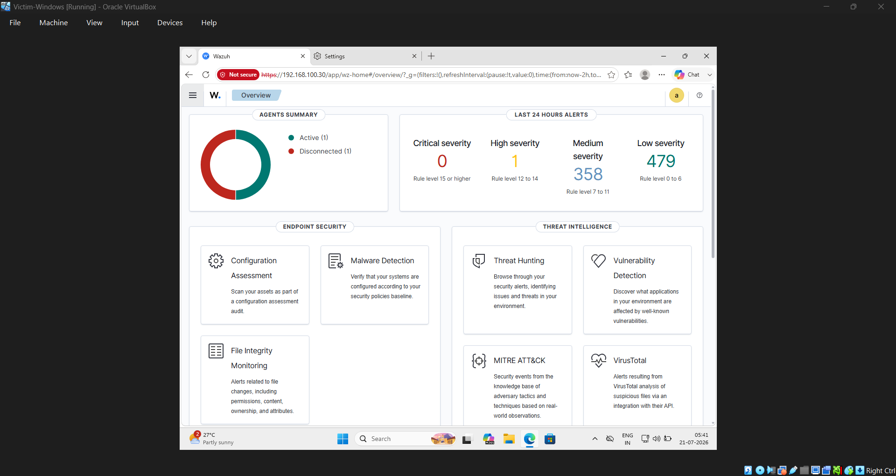

# 🛡️ Home Lab SOC: Self-Hosted Wazuh SIEM for Attack Detection & Endpoint Monitoring

## Overview

This project demonstrates the design, deployment, and administration of a self-hosted Security Operations Center (SOC) home lab using **Wazuh SIEM**. The lab was built in an isolated VirtualBox environment to safely simulate real-world attack scenarios, monitor endpoint activity, and investigate security events.

The objective was not only to deploy a SIEM solution, but also to troubleshoot networking issues, configure endpoint monitoring, execute reconnaissance techniques, and validate detections through Windows event logs and the Wazuh dashboard.

---

## Objectives

* Build an isolated cybersecurity home lab using VirtualBox.
* Deploy and configure a self-hosted Wazuh SIEM server.
* Connect Windows endpoints to Wazuh for centralized monitoring.
* Simulate reconnaissance and attack activity in a controlled environment.
* Validate detections using Windows Security logs and Wazuh alerts.
* Document troubleshooting, root-cause analysis, and remediation steps.

---

## Lab Architecture

```text
                Internal Virtual Network

        +-------------------------------+
        |       Ubuntu Server           |
        |     Wazuh Manager & Dashboard |
        +---------------+---------------+
                        |
        ----------------+----------------
                        |
        +---------------+---------------+
        |                               |
+---------------+               +---------------+
| Windows VM    |               | Attacker VM   |
| Wazuh Agent   |               | Nmap / Tools  |
+---------------+               +---------------+
```

---

## Technologies Used

* Wazuh SIEM
* Ubuntu Server
* Windows
* Oracle VirtualBox
* Linux Networking
* Windows Defender Firewall
* Windows Event Viewer
* Nmap
* SMB / Windows Authentication
* systemd
* Windows Registry
* NetworkManager

---

## Skills Demonstrated

* Security Information and Event Management (SIEM)
* Endpoint Detection & Monitoring
* Virtualization
* Linux System Administration
* Windows Administration
* Network Troubleshooting
* Internal Network Design
* Threat Detection
* Incident Response
* Root Cause Analysis
* Documentation

---

## Project Highlights

### Environment Deployment

* Designed a three-VM isolated cybersecurity lab.
* Configured custom internal networking.
* Installed and administered Wazuh on Ubuntu Server.
* Connected Windows endpoints for centralized monitoring.

---

### Endpoint Monitoring

Configured Wazuh agents to collect:

* Windows Security Events
* Authentication Logs
* System Events
* Endpoint Status
* Security Alerts

---

### Attack Simulation

Performed controlled security testing including:

* Network reconnaissance with Nmap
* SMB enumeration
* Windows authentication testing
* Connectivity validation
* Endpoint event generation

The resulting activity was monitored through Wazuh to verify alert generation and log collection.

---

### Troubleshooting & Root Cause Analysis

Throughout the project, several operational issues were investigated and resolved, including:

* Windows agent enrollment failures
* NetworkManager configuration issues
* Windows Defender Firewall communication blocks
* Internal network connectivity problems
* Wazuh agent registration issues

Each issue was documented with its root cause, troubleshooting methodology, and final resolution.

---

## Detection Workflow

1. Deploy Wazuh Manager
2. Configure isolated networking
3. Install Windows Wazuh Agent
4. Enroll endpoint
5. Generate security activity
6. Collect Windows Security Events
7. Detect events within Wazuh
8. Investigate alerts using the dashboard

---

## Lessons Learned

This project strengthened practical experience in:

* Building enterprise-style security monitoring environments
* Linux and Windows administration
* Endpoint visibility
* Network troubleshooting
* Security event analysis
* Incident investigation
* System documentation

It also reinforced the importance of methodical troubleshooting and validating each configuration step when deploying security infrastructure.

---

## Future Improvements

Planned enhancements include:

* Active Directory integration
* Sysmon deployment for enhanced telemetry
* Custom Wazuh detection rules
* MITRE ATT&CK mapping
* Automated attack simulations
* Vulnerability scanning integration
* Log forwarding from additional Linux systems
* Dashboard customization
* Incident response playbooks
* 
---

## Screenshots

### VirtualBox Lab Infrastructure


### Wazuh SIEM Dashboard Overview


* Agent Status & Telemetry
* Security Alerts Breakdown
* Nmap & Attack Simulation Detections
* Windows Event Log Analysis

---

* Lab topology
* VirtualBox configuration
* Wazuh Dashboard
* Agent status
* Security alerts
* Nmap scan results
* Windows Event Viewer
* Detection timelines

---

## Key Takeaways

This project demonstrates hands-on experience with:

* Wazuh SIEM deployment
* Security monitoring
* Endpoint management
* Linux and Windows administration
* Network architecture
* Incident detection and response
* Technical troubleshooting
* Cybersecurity documentation

---

## Author

Built as a personal cybersecurity home lab to develop practical SOC, blue-team, and security operations skills through hands-on implementation and attack simulation.
